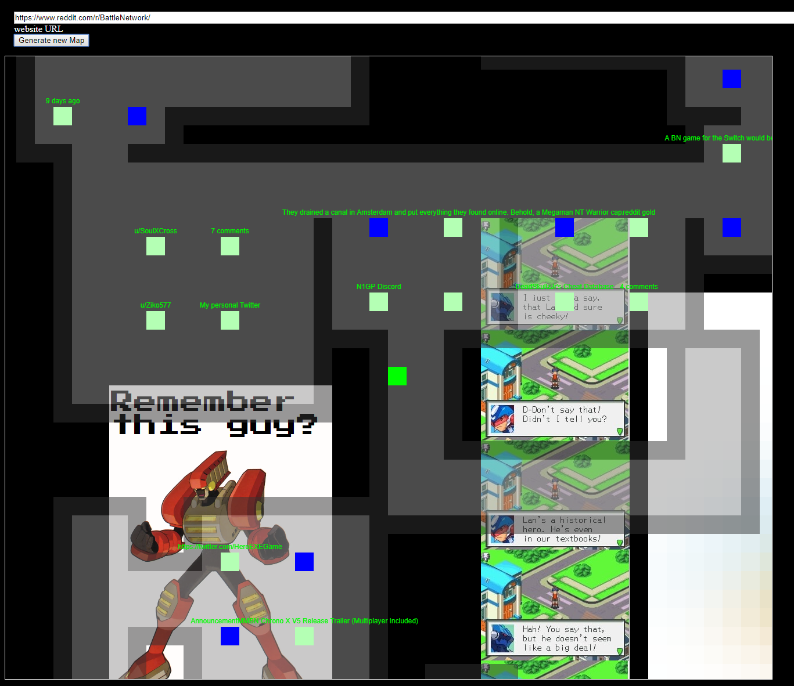

# Old-Multiplayer-Website-Explorer
old prototype for a game that lets you explore the internet in a maze like environment - with multiplayer

If you have node.js with npm installed, download and install the required packages with "npm install"
then run the web server with "node server.js", after that visit localhost:3000 to try the prototype

Honestly I'm surpised this still works, atleast in chrome it does. WASD to move around, + and - zoom in and out, it is very buggy.
If multiple people visit the same site, their positions will be synced using socket.io, but keep in mind that different browsers generate different layouts due to differences in random number generation.

Here is is a screenshot showing the layout generated by visiting https://www.reddit.com/r/BattleNetwork/

I wanted to turn this into a Megaman Battle Network like game, but I'll never touch this code again, Might reattempt this with my improved Javascript knowledge.
